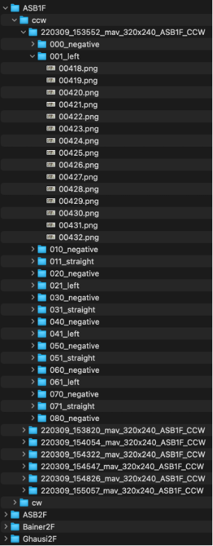
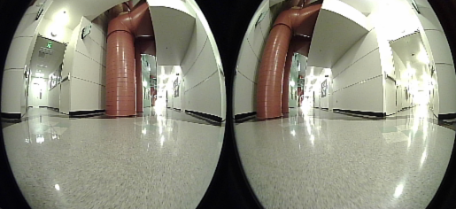

# Description-based Navigation System (DNS)
This repository contains the code associated with the paper "Hierarchical end-to-end autonomous navigation through few-shot waypoint detection."

Note: this branch contains code and instructions for training and testing the waypoint detection model. The code and instructions for training the steering model are available at the "[steering](https://github.com/Soltanilara/DNS/tree/Steering)" branch of this repository. The data used for both models can be downloaded via the link in the paper manuscript.

---

## Update: pretrained model

Pretrained model can be downloaded [here](https://drive.google.com/file/d/1hjGmIkXmtw9Q_jmvPrY9sdsvf7f25bKL/view?usp=sharing).

---

## Evironment setup

### Create and activate virtual environment
```bash
python -m venv dns
source dns/bin/activate
```

### Install dependencies
```bash
pip install -r requirements.txt
```

Install PyTorch from the official website.

---

## Training

### 1. Prepare dataset

Ensure that the dataset folder is in the structure shown below:



Each image in the dataset is a horizontal concatenation of the original left and right images from the stereo camera
system (see the sample image below).



### 2. Create dataset index

Use [CreateCOCOFile.py](tools/dataset/CreateCOCOFile.py)

1. Change variables `dataset_root` and `dir_output` to the directories of the root of the dataset and the expected
   output folder for the generated index files.

2. Change variable `mode` to a list with only one element to specify the mode as train/val/test. In test mode, a cw lap
   would be concatenated with a ccw lap, and separate index files would be generated for each different combination. If
   the mode is “train” or “val”, a single index that includes all the used laps will be generated and saved to
   `dir_output`.

3. Enable the flag `unseen_locations_in_val` to include validation locations only in validation, in this way, training
   and validation locations have no overlap and all the laps in a training location are used for training. Otherwise, two laps from training locations
   will be reserved for validation.

### 3. Edit training configuration

In [ModelTrainer.py](ModelTrainer.py), change the following variables:

* `dir_dataset`: the root directory of the dataset in Step 1.
* `dir_coco`: the directory that include the training and validation index files generated in Step 2.
* `dir_output`: the output directory for small log files (loss, accuracy, etc.) generated in training.
* `dir_ckpt`: the output directory for saved model checkpoints.

### 4. Run training

Run [ModelTrainer.py](ModelTrainer.py) with arguments that need to be changed in the configuration (see lines 27 to 60 in [ModelTrainer.py](ModelTrainer.py) for the
list of arguments, their default values and explanations). Please check [train.sh](train.sh) for sample usages.

---

## Testing

### 1. In [testing.py](testing.py), change the following variables:

* `root_dataset`: the same dataset directory used in training.
* `dir_coco`: the directory with only the separate testing location folders containing files generated
  by [CreateCOCOFile.py](tools/dataset/CreateCOCOFile.py) in test mode.
* `locations`: the list of locations to test. Listed locations should be a subset of the location folders in `dir_coco`.

### 2. Run testing [testing.py](testing.py)

Run [testing.py](testing.py) with arguments that need to be set in the configuration (see line 120 to 129 in [testing.py](testing.py) for the list of arguments,
their default values and explanations). Please check [test.sh](test.sh) for sample usages.

In each test, log files corresponding to each tested location (`plot_log_[location].json`) will be generated and saved
to `output/log/[model_name]` for the subsequent analysis.

---

## Analysis (calculate per landmark F1 score)

### 1. In [log_to_f1.py](log_to_f1.py), change the following variables:

* `dir_log`: the directory where the test results are saved.
* `names`: a list of names (determined by the parameter when running [testing.py](testing.py)) of the models to be
  tested.
* `locations`: a list of locations to be analyzed.
* `threshold`: the threshold for triggering a landmark detection.

### 2. Run [log_to_f1.py](log_to_f1.py), the script calculates the F1 score and reports it in the terminal output.

---

## Citation

If you find this repository useful, please cite our paper:

```bibtex
@ARTICLE{10433735,
  author={Ghafourian, Amin and CuiZhu, Zhongying and Shi, Debo and Chuang, Ian and Charette, Francois and Sachdeva, Rithik and Soltani, Iman},
  journal={IEEE Robotics and Automation Letters}, 
  title={Hierarchical End-to-End Autonomous Navigation Through Few-Shot Waypoint Detection}, 
  year={2024},
  volume={9},
  number={4},
  pages={3211-3218},
  doi={10.1109/LRA.2024.3365294}}
```
