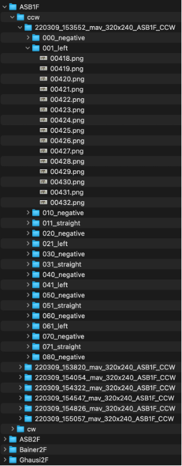
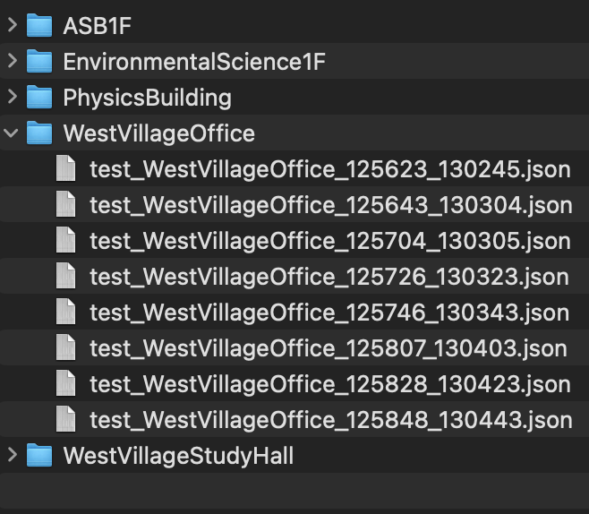

# Instruction for Running the Code – Description-based Navigation System (DNS)
Note: We are currently in the process of cleaning up our codes and adding instructions on how to run various modules. 
At the moment this repo includes the few-shot learning module. In the next week or so we will add other modules for low-level maneuver control as well as data segmentation which uses the steering signal to segment the course into positive and negative classes for few-shot training.

## Training

### 1. Prepare dataset

Construct the dataset folder in the structure shown in the screenshot below (080_negative, Analysis, plot.html and
plot.json are not necessary):

Each image in the dataset is a horizontal concatenation of the original left and right images from the stereo camera
system (see the sample image below). Images are required to be saved in PNG format to avoid the mismatch with the
lossless images captured by the cameras in online tests.

### 2. Create dataset index

Use [CreateCOCOFile.py](tools/dataset/CreateCOCOFile.py)

1. Change variables `dataset_root` and `dir_output` to the directories of the root of the dataset and the expected
   output folder for the generated index files.

2. Change variable `modes` to a list with only one element to specify the mode as train/val/test. In test mode, a cw lap
   would be concatenated with a ccw lap, and separate index files would be generated for each different combination. In
   the mode is “train” or “val”, a single index that include all the used laps would be generated and saved to
   `dir_output`.

3. Enable the flag `unseen_locations_in_val` to include evaluation locations only in evaluation, in this way, training
   and evaluation locations have no overlap and all the laps in a training location are used for training. Otherwise,
   the all the locations would be used in training or evaluation with 2 laps from each reserved for evaluation.

### 3. Edit training configuration

In [ModelTrainer.py](ModelTrainer.py), change the following variables:

* `dir_dataset`: the root directory of the dataset in Step 1.
* `dir_coco`: the directory that include the training, validation index files generated in Step 2.
* `dir_output`: the output directory for small log files (loss, accuracy, etc.) generated in training.
* `dir_ckpt`: the output directory for saved model weights.

### 4. Run training

Run [ModelTrainer.py](ModelTrainer.py) with arguments (see line 28 to 63 in [ModelTrainer.py](ModelTrainer.py) for the
list of arguments, their default values and explanations) that need to be changed in the configuration. Please
check [train.sh](train.sh) for sample usages.

---

## Testing

### 1. In [testing.py](testing.py), change the following variables:

* `root_dataset`: the same dataset directory used in training.
* `dir_coco`: the directory with only the separate testing index files generated
  by [CreateCOCOFile.py](tools/dataset/CreateCOCOFile.py) in test mode (structure shown in the below screenshot)
  .
  
* `locations`: the list of locations to test. Listed locations should be a subset of the location folders in `dir_coco`.

### 2. Run testing [testing.py](testing.py)

Run [testing.py](testing.py) with arguments (see line 138 to 147 in [testing.py](testing.py) for the list of arguments,
their default values and explanations) that need to be changed in the configuration. Please check [test.sh](test.sh) for
sample usages.

In each test, log files corresponding to each tested location (`plot_log_[location].json`) would be generated and saved
to `output/log/[model_name]` for the subsequent analysis.

---

## Analysis (calculate per landmark F1 score)

### 1. In [log_to_f1.py](tools/visulization/log_to_f1.py), change the following variables:

* `dir_log`: the directory where the test results are saved.
* `names`: a list of names (determined by the parameter when running [testing.py](testing.py)) of the models to be
  tested.
* `locations`: a list of locations to be analyzed.
* `threshold`: the threshold for triggering a landmark detection.

### 2. Run [log_to_f1.py](tools/visulization/log_to_f1.py), the script calculates the F1 score and reports it in the terminal output.
